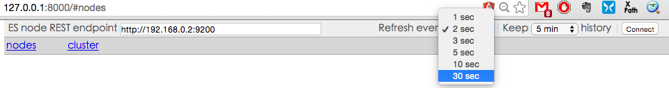
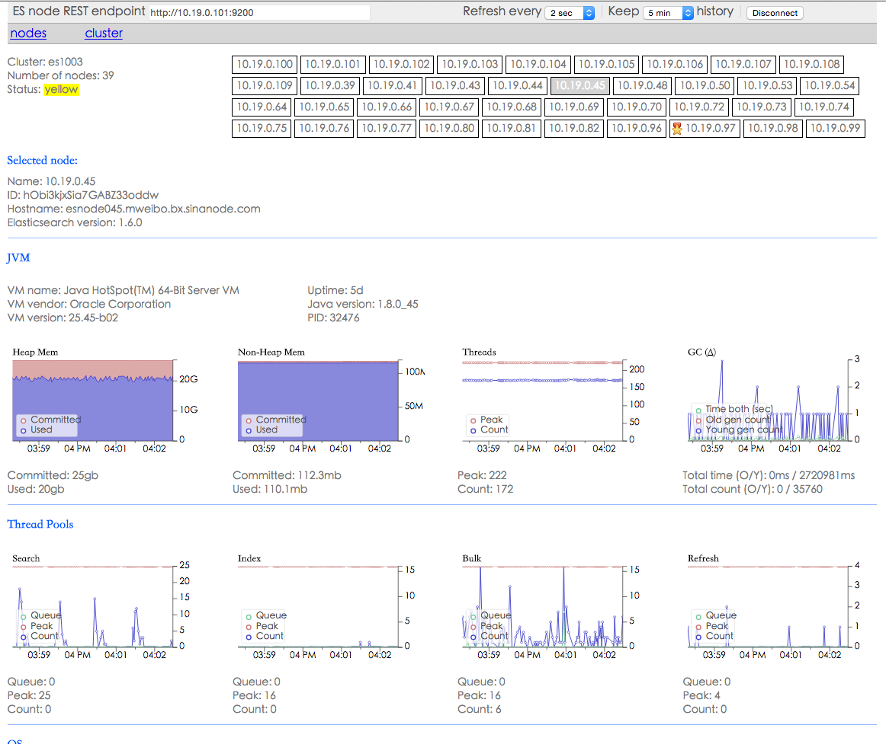
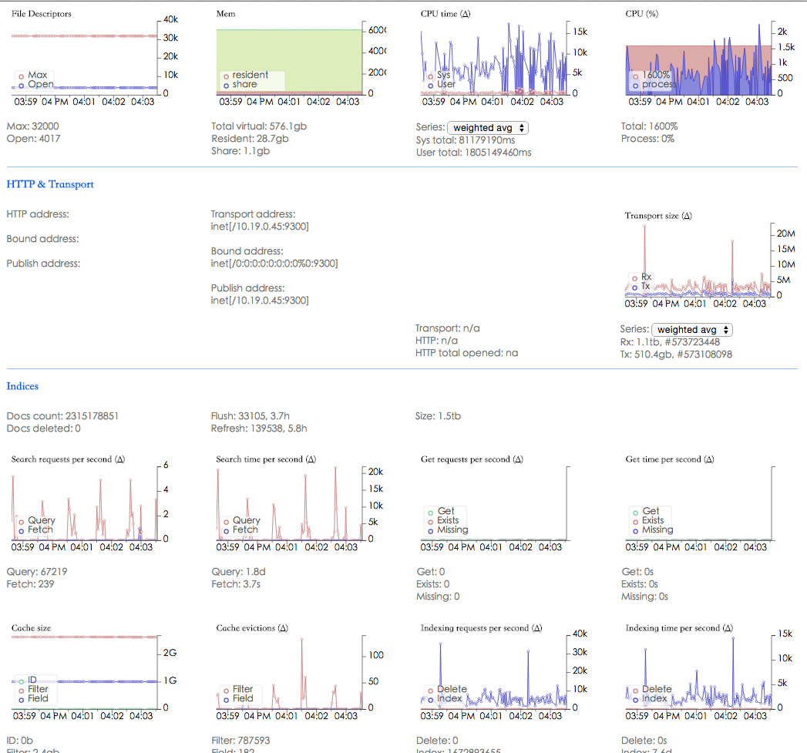

# bigdesk

要想最快的了解 ES 各节点的性能细节，推荐使用 bigdesk 插件，其原作者为 lukas-vlcek。但是从 Elasticsearch 1.4 版本开始就不再更新了。国内有用户 fork 出来继续维护到支持 5.0 版本，GitHub 地址见：<https://github.com/hlstudio/bigdesk>

bigdesk 通过浏览器直连 ES 节点，发起 RESTful 请求，并渲染结果成图。所以其安装部署极其简单：

```
# git clone https://github.com/hlstudio/bigdesk
# cd bigdesk/_site
# python -mSimpleHTTPServer
Serving HTTP on 0.0.0.0 port 8000 ...
```

浏览器打开 `http://localhost:8000` 即可看到 bigdesk 页面。在 **endpoint** 输入框内填写要连接的 ES 节点地址，选择 refresh 间隔和 keep 时长，点击 **connect**，完成。



注意：设置 refresh 间隔请考虑 Elastic Stack 使用的 template 里实际的 `refresh_interval` 是多少。否则你可能看到波动太大的数据，不足以说明情况。

点选某个节点后，就可以看到该节点性能的实时走势。一般重点关注 JVM 性能和索引性能。

有关 JVM 部分截图如下：



有关数据读写性能部分截图如下：



