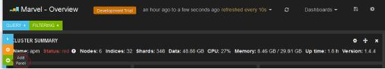
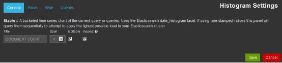
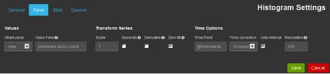
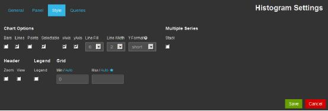
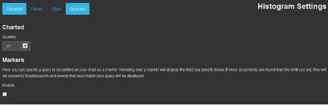
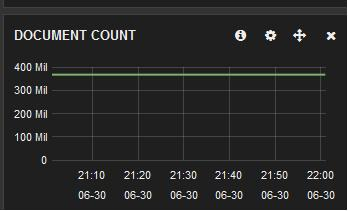

# marvel

*本节作者：lemontree*

marvel 是 Elastic.co 公司推出的商业监控方案，也是用来监控 Elasticsearch 集群实时、历史状态的有力用具，便于性能优化以及故障诊断。监控主要分为六个层面，分别是集群层、节点层、索引层、分片层、事件层、Sense。

* 集群层：主要对集群健康情况进行汇总，包括集群名称、集群状态、节点数量、索引个数、分片数、总数据量、集群版本等信息。同时，对节点、索引整体情况分别展示。
* 节点层：主要对每个节点的 CPU 、内存、负载、索引相关的性能数据等信息进行统计，并进行图形化展示。
* 索引层：展示的信息与节点层类似，主要从索引的角度展示。
* 分片层：从索引、节点两个角度展示分片的分布情况，并提供 playback 功能演示分片分配的历史过程。
* 事件层：展示集群相关事件，如节点脱离、加入，Master 选举、索引创建、Shard 分配等。
* Sense：轻量级的开发界面，主要用于通过 API 查询数据，管理集群。

Elastic.co 公司的收费标准是：

* 开发模式免费
* 生产环境前 5 个节点，每年 1000 美元
* 之后每增加 5 个节点，每年加收 250 美元

## 安装和卸载

marvel 是以 elasticsearch 的插件形式存在的，可以直接通过插件安装：

```
# ./bin/plugin -i elasticsearch/marvel/latest
```

如果你是从官网下载的安装包，则运行：

```
# ./bin/plugin -i marvel -u file:///path/to/marvel-latest.zip
```

各节点都安装完毕后，可以通过下行命令来查看节点上的插件列表，检查列表中是否含有 marvel：

```
# curl http://127.0.0.1:9200/_nodes/_local/plugins
```

安装之后，插件自动运行，并将定期获取到的集群状态数据，存储在 `.marvel-YYYY.MM.DD` 索引中，以单台 ES 计算，该索引的大小在 500MB 左右。所以，如果在小规模环境下运行，首先请注意，不要让你宝贵的内存都花在 marvel 的数据索引上了。

如果不打算使用 marvel，在各节点上通过下行命令下载：

```
# ./bin/plugin -r marvel
```

## 配置

如果不想让 marvel 数据索引影响到生产环境 ES 的运行，可以搭建单独的 marvel 数据集群，而生产数据集群上通过主动汇报的方式把数据发送过去。

在两个集群都安装好 marvel 插件后，生产集群的 `elasticsearch.yml` 上添加如下配置：

```
marvel.agent.exporter.es.hosts: ["marvel-cluster-ip:9200"]
```

和大多数 cluster 设置一样，marvel 设置也是可以动态变更的：

```
# curl –XPUT 127.0.0.1:9200/_cluster/settings -d '{
    "transient" : {
        "marvel.agent.exporter.es.hosts": [ "192.168.0.2:9200", "192.168.0.3:9200" ]
    }
}'
```

数据接收端的 marvel 集群(即上一行写的 marvel-cluster-ip 代表的主机)则添加如下配置：

```
marvel.agent.enabled: false
```

即本身不启用 marvel，以免数据有混淆。

## 访问

既然是 ES 插件，访问地址自然是插件式的：`http://marvel-cluster-ip:9200/_plugin/marvel/index.html`

marvel 的监控页面是在 Kibana3 基础上稍有改造。如下图所示，其顶部菜单栏设计了一个下拉选择框，可以切换几个不同纬度的仪表板：


## 面板定制

Marvel的信息展示能够以Panel为单元进行个性化定制。每个Panel定制的过程比较类似。这里举例定制一个DOCUMENT COUNT文档数Panel，配置过程如下：

1. 点击红色椭圆部分，添加一个Panel:

2. 输入Panel的名字DOCUMENT COUNT:

3. 输入Panel Y 轴显示的值 "Primaries.docx.count":

4. 选择展示风格

5. 选择查看的集合，这里选择 *all*:

6. 一个Document Count Panel就完成了:

