# Grafana
Grafana是一个开源的指标量监测和可视化工具。常用于展示基础设施的时序数据和应用程序运行分析。Grafana的dashboard展示非常炫酷，绝对是运维提升逼格的一大利器。

官方在线的demo可以在这里找到: http://play.grafana.org/

grafana的套路基本上跟kibana差不多，都是根据查询条件设置聚合规则，在合适的图表上进行展示，多个图表共同组建成一个dashboard，熟悉kibana的用户应该可以非常容易上手。另外grafana的可视化功能比kibana强得多，后面逐步会介绍到，而且4以上版本将集成报警功能。

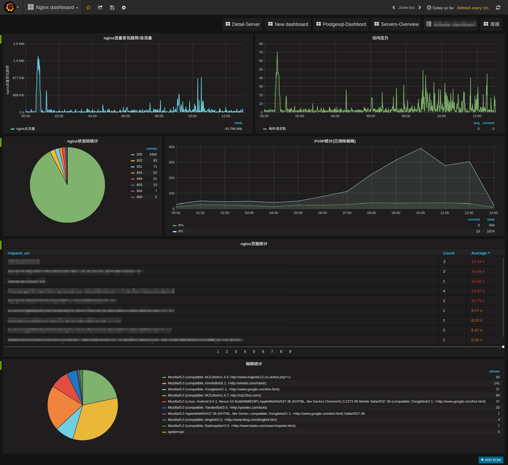

## 安装
Grafana的安装非常简单，官方就有软件仓库可以直接使用，也可以通过docker镜像等方式直接本地启动。

参考官方文档的安装方法，对应找到你的操作系统的安装方法即可: http://docs.grafana.org/

> 值得一提的是，由于官方仓库托管在S3上，国内用户直接访问苦不堪言，万幸的是清华大学tuna镜像站已经提供了grafana的镜像，只需要将官方文档中提到的仓库地址对应的换成清华大学的镜像站的地址即可:
>  https://mirrors.tuna.tsinghua.edu.cn/grafana/

安装完毕后，使用`service grafana-server start`就可以启动grafana，访问`http://your-host:3000`就可以看到登录界面了。

默认的用户名和密码都是`admin`。

> 默认情况下，grafana的配置存储于`sqlite3`中，如果你想使用其他存储后端，如`mysql`，`postgresql`等，请参考官方文档配置: http://docs.grafana.org/installation/configuration/

grafana的几个基本构成和基本概念参考官方文档: http://docs.grafana.org/guides/basic_concepts/ ，后面会逐步提到这些关键词。

## 配置数据源
先要明确一点，grafana只是一个dashboard(4版本开始将引入报警功能)，负责把数据库中的数据进行可视化展示，本身并不存储任何数据，另外某些查询和聚合使用的是数据库本身提供的功能，需要对应的数据库去支持。因此不代表你换了一个数据库后端就一定能展示相同的图形。

grafana目前支持的时序数据库有: Graphite, Prometheus, Elasticsearch, InfluxDB, OpenTSDB, AWS Cloudwatch。未来可能会有更多的数据库的支持加入，请关注更新。也可以使用第三方插件引入支持。

我们这里使用`Elasticsearch`作为数据库的来源。

首先进入数据源的设置页面，点击左上角的图标，选择`Data Sources`-`Add data sources`:

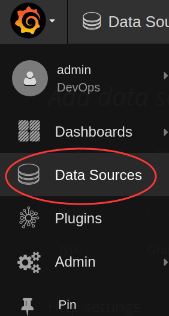

进入数据源的设置，例如我们要从`logstash-YYYY.MM.DD`这些index中读取数据，就像kibana默认的index那样，像这样配置即可:

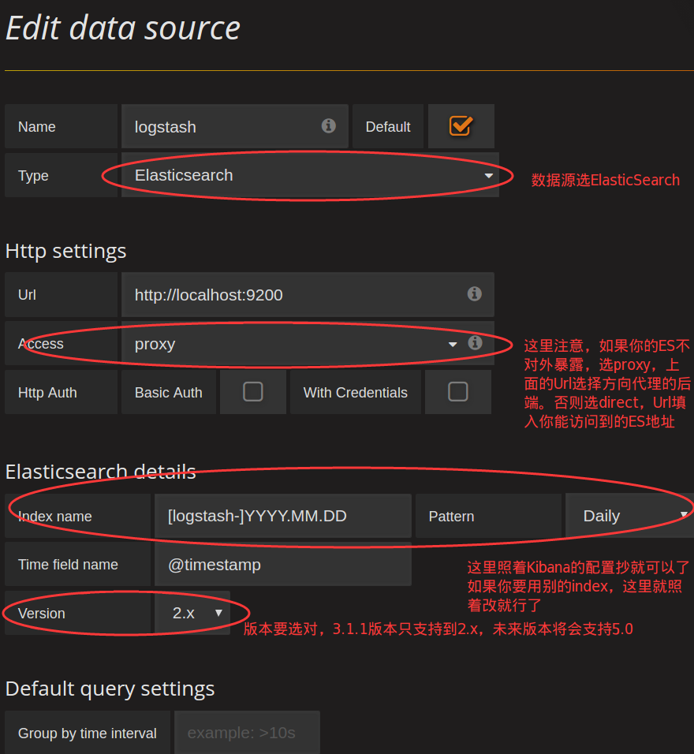

## 生成第一个图表
数据源配置好之后，就可以开始我们可视化的第一步了。这一步相对较为简单，只要熟悉ES的query-string-syntax( https://www.elastic.co/guide/en/elasticsearch/reference/5.0/query-dsl-query-string-query.html#query-string-syntax )就可以轻松写出来。

想创建图表，首先得有`dashboard`，new一个dashboard出来，就可以尽情的开搞了:

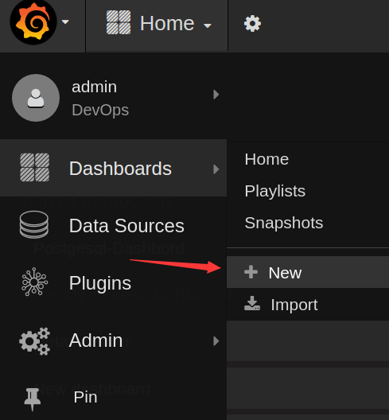

比如我现在通过`collectd`收集上来了cpu占用比的数据，希望绘制成CPU曲线，很明显我们需要创建一个`折线图`，那么在dashboard上new一个折线图的panel即可(graph):

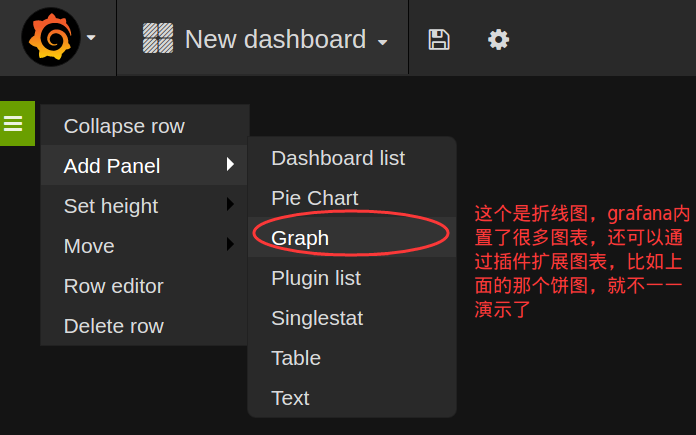

先在kibana中看看查询结果:

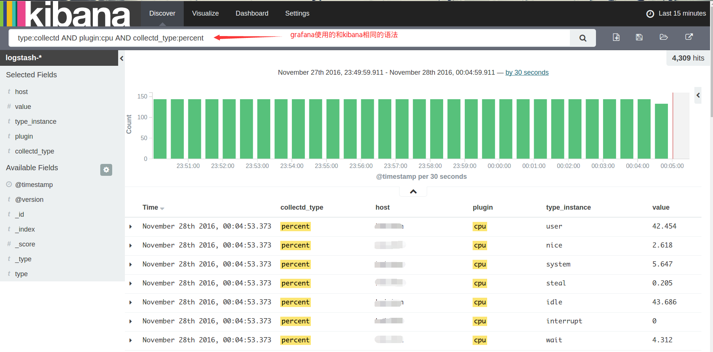

很明显，`value`是希望绘制到曲线上的点，而`type_instance`应该作为ES聚合的`bucket`，如果`host`有多个，那么`host`也应作为一个bucket，我们先不管这个host，后面会再说怎么按照host分图形，grafana有更巧妙的办法。

bucket的作用非常类似于sql中的`GROUP BY`，于是新建的panel的查询应该像这样:

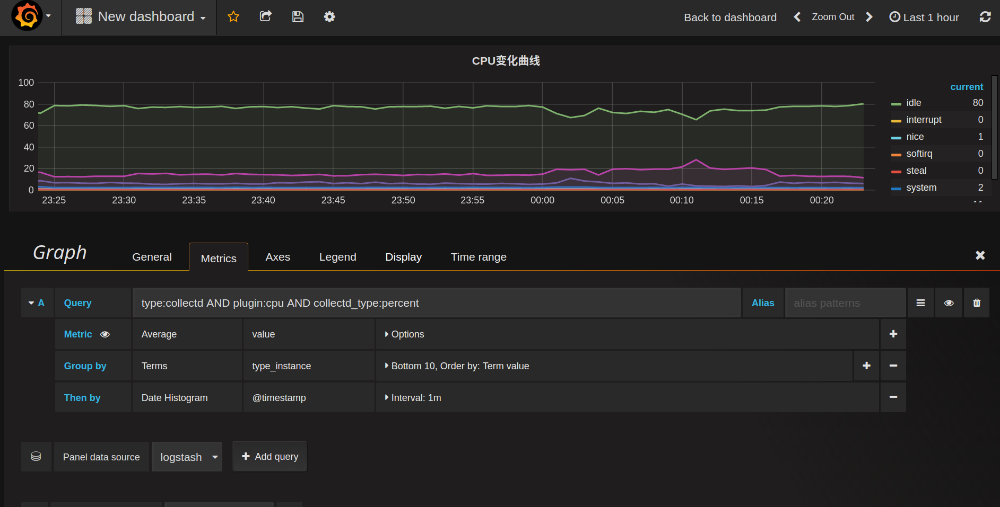

简单解释一下这些配置:
* **query**: 对应的就是kibana上面的查询条件，先把想要展示的数据全部select出来，然后进行聚合或筛选, **Alias**是给这个查询起个别名，可用于图例说明
* **metric**: 这个就是关键的指标量的，到底展示的是什么东西。这里展示的是GROUP BY之后对value求平均值
* **Group by**: 对应elasticsearch的bucket，按照`type_instance`分桶

整个查询下来大致相当于SQL中的`SELECT avg(value) WHERE query_string('type:collectd AND plugin:cpu AND collectd_type:percent') GROUP BY type_instance GROUP BY Date_Histogram(@timestamp)`

如果只关心CPU的消耗，不关心CPU的空闲(idle)，希望仅仅把`idle`曲线隐藏掉，也很简单，只要在`Display`的选项卡中选择隐藏掉`idle`的line即可，瞧:

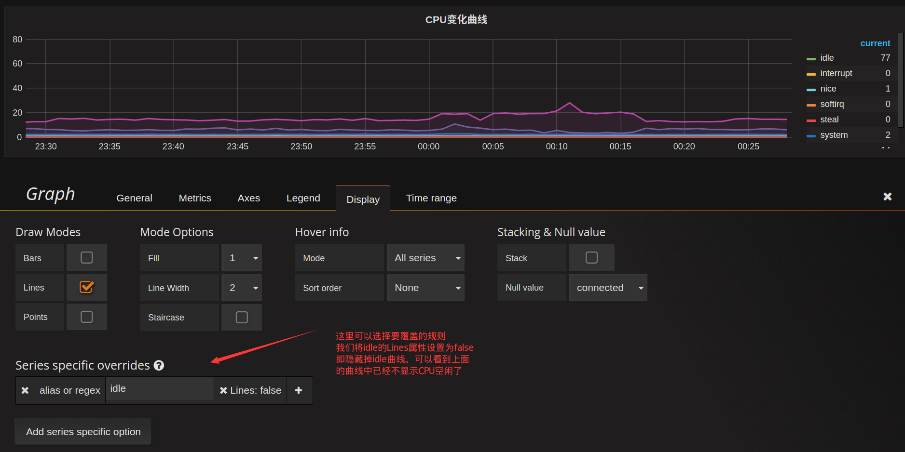

graph图表能配置的项很多，包括图例的颜色，位置，显示的值等等，甚至可以配置数据的单位，以便于更优雅的展示，这里就不一一列举了。

把希望展示的图表一个个加进去，最终一个完整的dashboard就生成了:

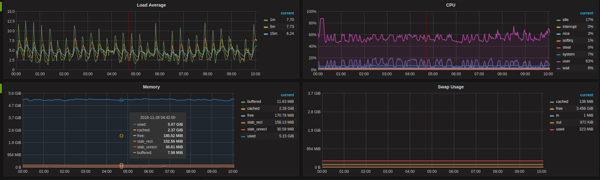

## 模板功能
这个功能实在是grafana的一大亮点，不得不提。模板可以让你轻松的批量生成同一类型的查询，而不用一个个添加这些panel，实在是生成动态可视化图表的大杀器。

比如现在要统计各个网卡的流量，而服务器可能包含多个网卡，`lo`,`eth0`,`eth1`等等，按照前面的套路，可能会想到将网卡名作为bucket进行GROUP BY操作。思路没错，但是这会导致所有网卡的流量在同一个图表显示，当网卡多的时候非常凌乱。再比如网卡之间可能流量根本不对等，某块网卡的流量高出其他网卡好几个数量级，这将导致其他网卡的流量曲线非常接近0，以至于几乎看不清楚流量变化了。

因此需要将不同的网卡流量放在不同的panel分别展示，但是不同服务器的网卡数量可能又不一样，因此查询条件没法写成一个固定的，需要动态化。

先从kibana看看网卡流量的查询:

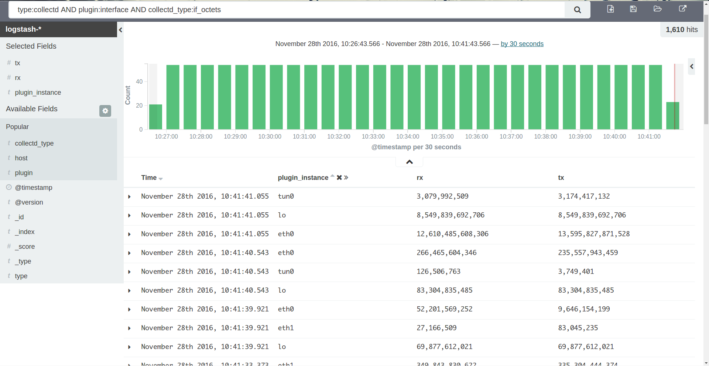

查询条件为`type:collectd AND plugin:interface AND collectd_type:if_octets`，可以得到所有网卡每一时刻的`rx`,`tx`的值。如果我们要得到每一块网卡的流量，很明显要再追加一个动态查询条件`AND plugin_instance:$interface`，需要提前对`plugin_instance`做一次`distinct`，拿出所有可能的值，再拼接到这个动态查询上。这个就是grafana模板的基本使用方式。

要想使用模板，首先要先创建动态参数的查询条件，在顶部点击设置按钮，进入`Templating`设置:

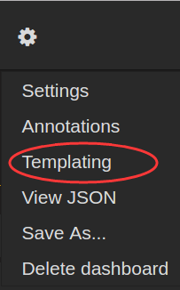

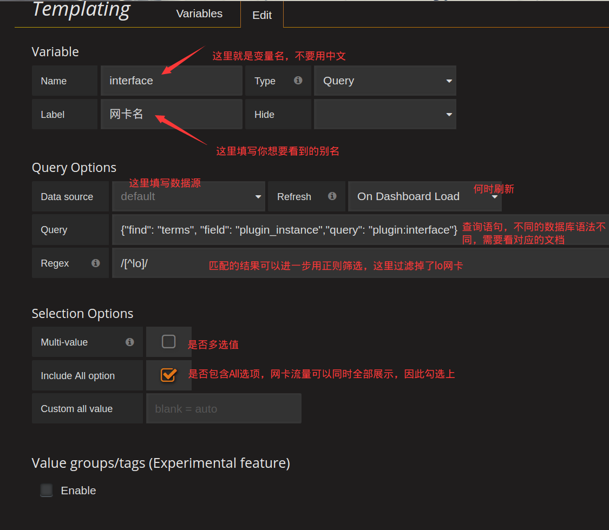

最关键的地方在`Query`这个配置，这里就是定义怎么获取到`$interface`这个变量的所有可选值，每个数据库的语法不一样，比如Elasticsearch的Template语法在这里: http://docs.grafana.org/datasources/elasticsearch/#templating ，如果你使用的是其他数据源，那么查询对应数据源的模板语法即可。

这个查询就相当于在`plugin:interface`这个查询条件下，对`plugin_instance`这个field进行distinct操作，结果再使用`/[^lo]/`正则过滤，将`lo`这个结果从结果集中排除掉。

结束后我们就可以看到了这样的单选下拉框:

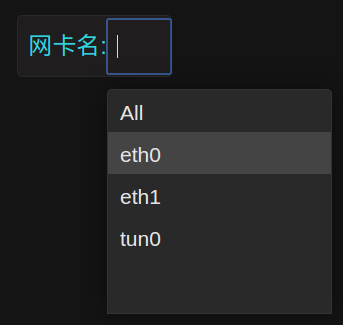

引入了`$interface`这个变量后，我们就可以对查询条件做下改进了:

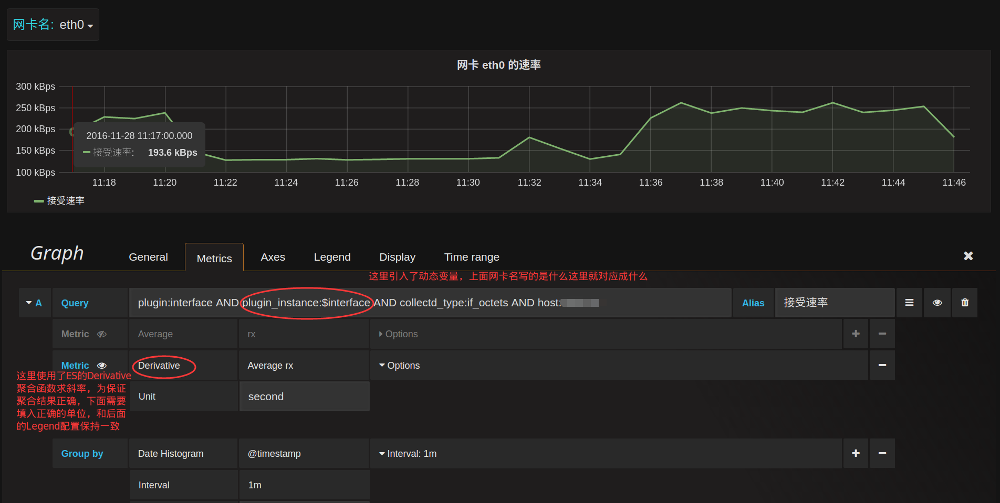

现在这个图形就会跟着上面网卡名的改变而改变了。如果希望选择`All`的时候，能同时展示多块网卡，需要把这一个panel进行重复就可以了，在`General`选项卡启用`repeat`:

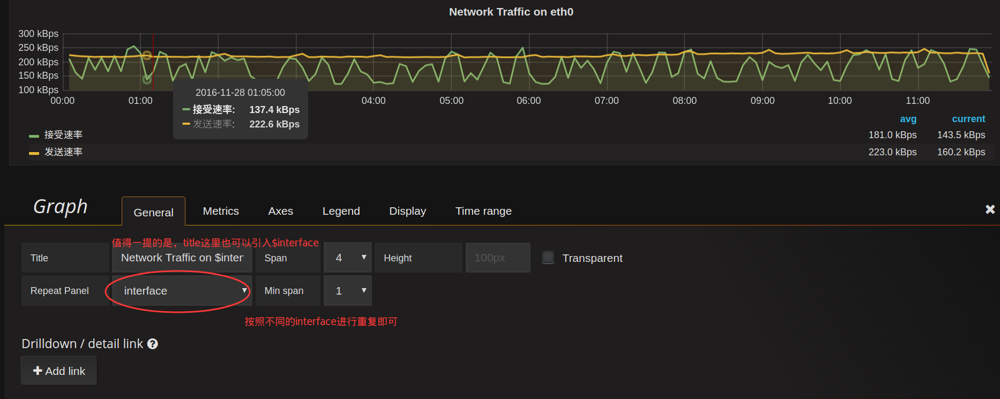

当网卡名选择`All`的时候，就会将所有的网卡流量曲线图repeat成一行(row):

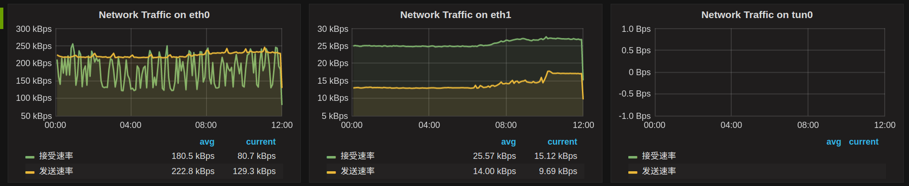

同理，如果`Templating`那里将`Multi-value`勾选上，那么网卡名这里就可以勾选上你希望展示的网卡名，并不限于单选。

现在再回到一开始遗留的问题，host匹配的问题，利用模板的特性就可以非常优雅的搞定这个问题。

创建一个host的模板:

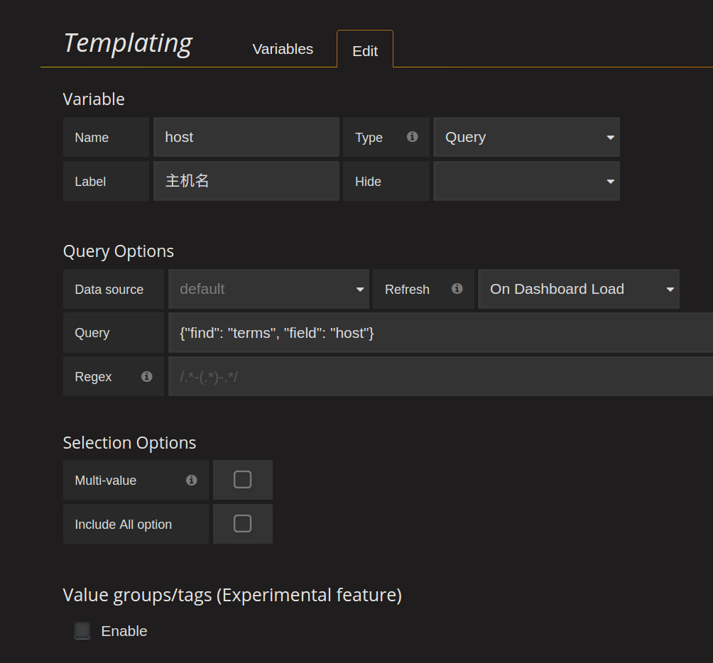

这样前面所有的查询`Query`再追加一个条件`AND host:$host`，就可以对每个主机生成一个单独的dashboard界面了:

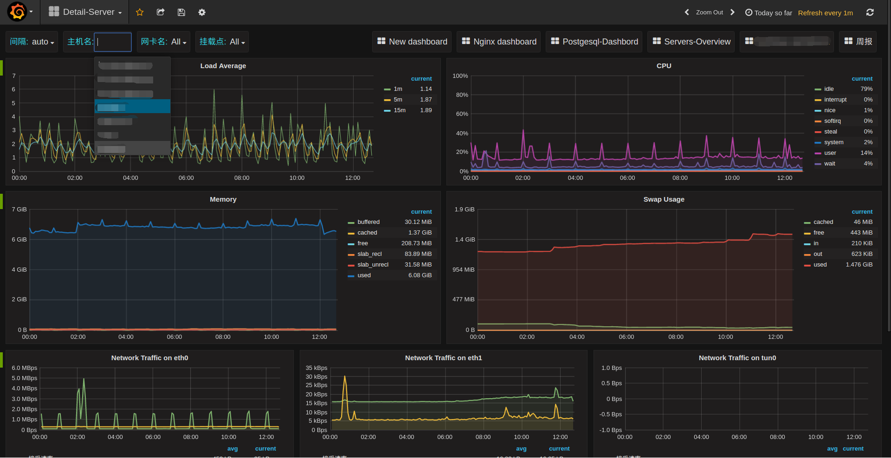

不止panel可以repeat(似乎只能repeat成一行)，连row都可以repeat:

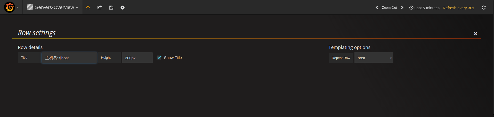

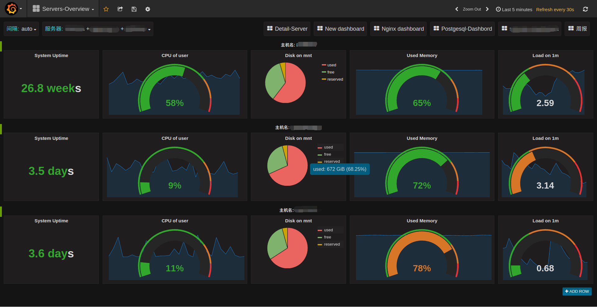

每行一个服务器的概览图，repeat之后就可以将多个服务器的主要指标放在一个dashborad中了。

grafana的玩法还有很多，期待慢慢发掘，更多详情可以参考官方文档。

## 在线资源
grafana提供了一些在线资源，可以帮助使用者更方便的使用grafana，比如在线dashboard( https://grafana.net/dashboards )可以帮助快速生成一个美观的dashboard，不用自己花心思去布局了，再比如在线的插件仓库( https://grafana.net/plugins )可以帮助连接其他数据源，如zabbix，Open-Falcon等，或添加其他展示图表，如饼图(Pie chat)。

合理利用这些在线资源可以让grafana更加完善易用。

## 参考资料

* grafana官方文档: http://docs.grafana.org/
* elasticsearch官方文档: https://www.elastic.co/guide/en/elasticsearch/reference/2.4/index.html
