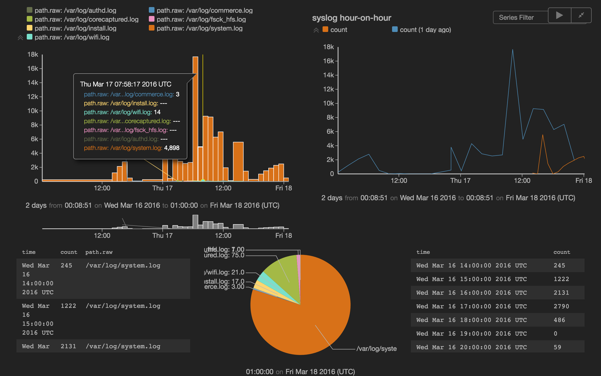

# juttle 介绍

juttle 是一个 nodejs 项目，专注于数据处理和可视化。它自定义了一套自己的 DSL，提供交互式命令行、程序运行、界面访问三种运行方式。

在 juttle 的 DSL 中，可以用 `|` 管道符串联下列指令实现数据处理：

* 通过 read 指令读取来自 http、file、elasticsearch、graphite、influxdb、opentsdb、mysql 等数据源，
* 通过 filter 指令及自定义的 JavaScript 函数做数据过滤，
* 通过 reduce 指令做数据聚合，
* 通过 join 指令做数据关联，
* 通过 write 指令做数据转储，
* 通过 view 指令做数据可视化。

更关键的，可以用 `()` 并联同一层级的多条指令进行处理。

看起来非常有意思的项目，赶紧试试吧。

## 安装部署

既然说了这是一个 nodejs 项目，自然是通过 npm 安装了：

```
sudo npm install -g juttle
sudo npm install -g juttle-engine
```

注意，如果是在 MacBook 上安装的话，一定要先通过 AppStore 安装好 Xcode 并确认完 license。npm 安装依赖的 sqlite3 的时候没有 xcode 会僵死在那。

juttle 包提供了命令行交互，juttle-engine 包提供了网页访问的服务器。

juttle 的配置文件默认读取位置是 `$HOME/.juttle/config.json`。比如读取本机 elasticsearch 的数据，那么定义如下：

```json
{
    "adapters": {
        "elastic": {
            "address": "localhost",
            "port": 9200
        }
    }
}
```

甚至可以读取多个不同来源的 elasticsearch，这样：

```json
{
    "adapters": {
        "elastic": [{
            "id": "one",
            "address": "localhost",
            "port": 9200
        }, {
            "id": "two",
            "address": "localhost",
            "port": 9201
        }],
        "influx": {
            "url": "http://examples_influxdb_1:8086",
            "user": "root",
            "password": "root"
        }
    }
}
```

## 命令行运行示例

配置完成，就可以交互式命令行运行了。终端输入 `juttle` 回车进入交互界面。我们输入下面一段查询：

```
juttle> read elastic -id one -index 'logstash-*'  -from :1 year ago: -to :now: 'MacBook-Pro' | reduce -every :1h: c = count() by path | filter c > 1000 | put line = 10000 | view table -columnOrder 'time', 'c', 'line', 'path'
```

输出如下：

```
┌────────────────────────────────────┬──────────┬──────────┬─────────────────────────────┐
│ time                               │ c        │ line     │ path                        │
├────────────────────────────────────┼──────────┼──────────┼─────────────────────────────┤
│ 2016-03-02T10:00:00.000Z           │ 4392     │ 10000    │ /var/log/system.log         │
├────────────────────────────────────┼──────────┼──────────┼─────────────────────────────┤
│ 2016-03-02T11:00:00.000Z           │ 4818     │ 10000    │ /var/log/system.log         │
├────────────────────────────────────┼──────────┼──────────┼─────────────────────────────┤
│ 2016-03-02T12:00:00.000Z           │ 2038     │ 10000    │ /var/log/system.log         │
├────────────────────────────────────┼──────────┼──────────┼─────────────────────────────┤
│ 2016-03-02T13:00:00.000Z           │ 1826     │ 10000    │ /var/log/system.log         │
├────────────────────────────────────┼──────────┼──────────┼─────────────────────────────┤
│ 2016-03-02T15:00:00.000Z           │ 10267    │ 10000    │ /var/log/system.log         │
├────────────────────────────────────┼──────────┼──────────┼─────────────────────────────┤
│ 2016-03-02T16:00:00.000Z           │ 10999    │ 10000    │ /var/log/system.log         │
├────────────────────────────────────┼──────────┼──────────┼─────────────────────────────┤
│ 2016-03-02T17:00:00.000Z           │ 3528     │ 10000    │ /var/log/system.log         │
├────────────────────────────────────┼──────────┼──────────┼─────────────────────────────┤
│ 2016-03-03T00:00:00.000Z           │ 2498     │ 10000    │ /var/log/system.log         │
├────────────────────────────────────┼──────────┼──────────┼─────────────────────────────┤
│ 2016-03-03T03:00:00.000Z           │ 4600     │ 10000    │ /var/log/system.log         │
├────────────────────────────────────┼──────────┼──────────┼─────────────────────────────┤
│ 2016-03-03T04:00:00.000Z           │ 7751     │ 10000    │ /var/log/system.log         │
├────────────────────────────────────┼──────────┼──────────┼─────────────────────────────┤
│ 2016-03-03T05:00:00.000Z           │ 3249     │ 10000    │ /var/log/system.log         │
├────────────────────────────────────┼──────────┼──────────┼─────────────────────────────┤
│ 2016-03-03T06:00:00.000Z           │ 5715     │ 10000    │ /var/log/system.log         │
├────────────────────────────────────┼──────────┼──────────┼─────────────────────────────┤
│ 2016-03-03T07:00:00.000Z           │ 4374     │ 10000    │ /var/log/system.log         │
├────────────────────────────────────┼──────────┼──────────┼─────────────────────────────┤
│ 2016-03-03T08:00:00.000Z           │ 2600     │ 10000    │ /var/log/system.log         │
└────────────────────────────────────┴──────────┴──────────┴─────────────────────────────┘
```

漂亮的终端表格！

**警告**

需要注意的是，juttle 和 es-hadoop 一样，也是通过 RESTful API 和 elasticsearch 交互，所以除了个别已经提前实现好了的 reduce 方法可以转换成 aggregation 以外，其他的 juttle 指令，都是通过 query 把数据拿回来以后，由 juttle 本身做的运算处理。juttle-adapter-elastic 模块的 `DEFAULT_FETCH_SIZE` 设置是 10000 条。

而比 es-hadoop 更差的是，因为 juttle 是单机程序，它还没有像 es-hadoop 那样并发 partition 直连每个 elasticsearch 的 shard 做并发请求。

## juttle-viz 可视化界面

上一小节介绍了一下怎么用 juttle 交互式命令行查看表格式输出。juttle 事实上还提供了一个 web 服务器，做数据可视化效果，这个同样是用 juttle 语言描述配置。

我们已经安装好了 `juttle-engine` 模块，那么直接启动服务器即可：

```
~$ juttle-engine -d
```

然后浏览器打开 `http://localhost:8080` 就能看到页面了。注意，请使用 Chrome v45 以上版本或者 Safari 等其他浏览器，否则有个 Array 上的 bug。

但是目前这个页面上本身不提供输入框直接写 juttle 语言。所以需要我们把 juttle 语言写成脚本文件，再来通过页面加载。

```
~$ cat > ~/test.juttle <<EOF
read elastic -index 'logstash-*'  -from :-2d: -to :now: 'MacBook-Pro'
  | reduce -every :1h: count() by 'path.raw'
  | (
      view timechart -row 0 -col 0;;
      view table -height 200 -row 1 -col 0;
      view piechart -row 1 -col 0;
  );
(
  read elastic -index 'logstash-*'  -from :-2d: -to :-1d: 'MacBook-Pro' AND '/var/log/system.log'
    | reduce -every :1h: count();
  read elastic -index 'logstash-*'  -from :-1d: -to :now: 'MacBook-Pro' AND '/var/log/system.log'
    | reduce -every :1h: count();
)
  | (
      view timechart -duration :1 day: -overlayTime true -height 400 -row 0 -col 1 -title 'syslog hour-on-hour';
      view table -height 200 -row 1 -col 1;
  );
EOF
```

然后访问 `http://localhost:8080?path=/test.juttle`，注意这里的path参数的写法，这个/其实指的是你运行 `juttle-engine` 命令的时候的路径，而不是真的设备根目录。

就可以在浏览器上看到如下效果：



页面上还有一行有关 `path.raw` 的 WARNING 提示，那是因为 juttle 目前对 elasticsearch 的 mapping 解析支持的不是很好，但是不影响使用，可以不用管。

### 可视化相关指令介绍

我们可以看到这次的 juttle 脚本，跟昨天在命令行下运行的几个区别：

1. 我们用上了 `()`，这是 juttle 的一大特技，对同一结果并联多个 view ，或者并联多个输入结果做相同的后续处理等等。
2. 我们对 view 用上了 `row` 和 `col` 参数，用来指定他们在页面上的布局。
3. 有一个 `timechart` 我们用了 `-durat  :1d: -overlayTime true` 参数。这是 `timechart` 独有的参数，专门用来实现同比环比的。在图上的效果大家也可以看到了。不过目前也有小问题，就是鼠标放到图上的时候，只能看到第二个结果的指标说明，看不到第一个的。

