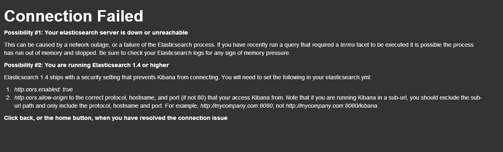

# 10 分钟入门

Kibana 对实时数据分析来说是特别适合的工具。本节内容首先让你快速入门，了解 Kibana 所能做的大部分事情。如果你还没下载 Kibana，点击右侧链接：[下载 Kibana](http://www.elasticsearch.org/overview/kibana/installation/)。我们建议你在开始本教程之前，先部署好一个干净的 elasticsearch 进程。

到本节结束，你就会：

* 导入一些数据
* 尝试简单的仪表板
* 搜索你的数据
* 配置 Kibana 只显示你的新索引而不是全部索引

我们假设你已经：

* 在自己电脑上安装好了 Elasticsearch
* 在自己电脑上搭建好了网站服务器，并把 Kibana 发行包解压到了发布目录里
* 对 UNIX 命令行有一点了解，使用过 `curl`

## 导入数据

我们将使用莎士比亚全集作为我们的示例数据。要更好的使用 Kibana，你需要为自己的新索引应用一个映射集(mapping)。我们用下面这个映射集创建"莎士比亚全集"索引。实际数据的字段比这要多，但是我们只需要指定下面这些字段的映射就可以了。注意到我们设置了对 speaker 和 play_name 不分析。原因会在稍后讲明。

在终端运行下面命令：

```
curl -XPUT http://localhost:9200/shakespeare -d '
{
 "mappings" : {
  "_default_" : {
   "properties" : {
    "speaker" : {"type": "string", "index" : "not_analyzed" },
    "play_name" : {"type": "string", "index" : "not_analyzed" },
    "line_id" : { "type" : "integer" },
    "speech_number" : { "type" : "integer" }
   }
  }
 }
}
';
```

很棒，我们这就创建好了索引。现在需要做的时导入数据。莎士比亚全集的内容我们已经整理成了 elasticsearch 批量 导入所需要的格式，你可以通过[shakeseare.json](http://www.elasticsearch.org/guide/en/kibana/3.0/snippets/shakespeare.json)下载。

用如下命令导入数据到你本地的 elasticsearch 进程中。这可能需要一点时间，莎士比亚可是著作等身的大文豪！

```
curl -XPUT localhost:9200/_bulk --data-binary @shakespeare.json
```

## 访问 Kibana 界面

现在你数据在手，可以干点什么了。打开浏览器，访问已经发布了 Kibana 的本地服务器。


如果你解压路径无误(译者注：使用 github 源码的读者记住发布目录应该是 `kibana/src/` 里面)，你已经就可以看到上面这个可爱的欢迎页面。点击 Sample Dashboard 链接


好了，现在显示的就是你的 sample dashboard！如果你是用新的 elasticsearch 进程开始本教程的，你会看到一个百分比占比很重的饼图。这里显示的是你的索引中，文档类型的情况。如你所见，99% 都是 lines，只有少量的 acts 和scenes。

再下面，你会看到一长段 JSON 格式的莎士比亚诗文。

## 第一次搜索

Kibana 允许使用者采用 Lucene Query String 语法搜索 Elasticsearch 中的数据。请求可以在页面顶部的请求输入框中书写。


在请求框中输入如下内容。然后查看表格中的前几行内容。

```
friends, romans, countrymen
```


关于搜索请求的语法，请阅读 [Queries and Filters](http://www.elasticsearch.org/guide/en/kibana/3.0/working-with-queries-and-filters.html)。

## 配置另一个索引

目前 Kibana 指向的是 Elasticsearch 一个特殊的索引叫 `_all`。 ` _all` 可以理解为全部索引的大集合。目前你只有一个索引， `shakespeare`，但未来你会有更多其他方面的索引，你肯定不希望 Kibana 在你只想搜《麦克白》里心爱的句子的时候还要搜索全部内容。

配置索引，点击右上角的配置按钮：


在这里，你可以设置你的索引为 `shakespeare` ，这样 Kibana 就只会搜索 `shakespeare` 索引的内容了。


## 下一步

恭喜你，你已经学会了安装和配置 Kibana，算是正式下水了！下一步，打开我们的视频和其他教程学习更高级的技能吧。现在，你可以尝试在一个空白仪表板上添加自己的面板。这方面的内容，请阅读 [Rows and Panels](http://www.elasticsearch.org/guide/en/kibana/3.0/rows-and-panels.html)。

## 译者注

在 Elasticsearch 发布 1.4 版后，使用 kibana3 访问 ES1.4 集群，会显示如下错误：



这是因为 ES1.4 增强了权限管理。你需要在 ES 配置文件 elasticsearch.yml 中添加下列配置并重启服务后才能正常访问：

```yaml
http.cors.enabled: true
http.cors.allow-origin: "*"
```

记住 kibana3 页面也要刷新缓存才行。

此外，如果你可以很明确自己 kibana 以外没有其他 http 访问，可以把 kibana 的网址写在 `http.cors.allow-origin` 参数的值中。比如：

```yaml
http.cors.allow-origin: "/https?:\/\/kbndomain/"
```
