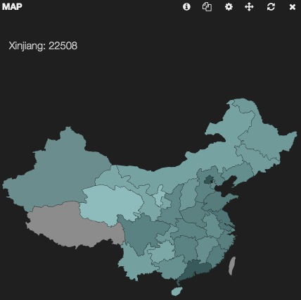
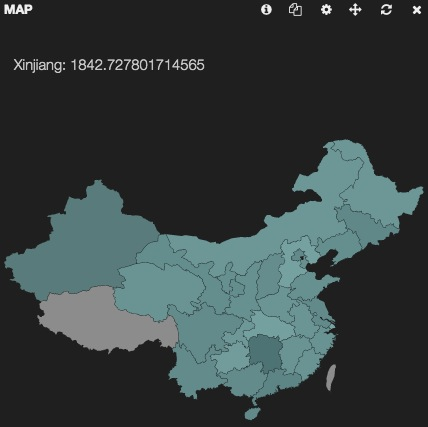

# map

状态：稳定

map 面板把 2 个字母的国家或地区代码转成地图上的阴影区域。目前可用的地图包括世界地图，美国地图和欧洲地图。

## 参数

* map

    显示哪个地图：world, usa, europe

* colors

    用来涂抹地图阴影的颜色数组。一旦设定好这 2 个颜色，阴影就会使用介于这 2 者之间的颜色。示例 [‘#A0E2E2’, ‘#265656’]

* size

    阴影区域的最大数量

* exclude

    排除的区域数组。示例 [‘US’,‘BR’,‘IN’]

* spyable

    设为假，不显示审查(inspect)按钮。

**请求(queries)**

* 请求对象

    这个对象描述本面板使用的请求。

  * queries.mode

    在可用请求中应该用哪些？可设选项有：`all, pinned, unpinned, selected`

  * queries.ids

    如果设为 `selected` 模式，具体被选的请求编号。

-----------------------------

## 界面配置说明

考虑到都是中国读者，本节准备采用中国地图进行讲解，中国地图代码，，基于本人 <https://github.com/chenryn/kibana.git> 仓库，除标准的 map 面板参数外，还提供了 `terms_stats` 功能，也会一并讲述。

map 面板，最重要的配置即输入字段，对于不同的地图，应该配置不同的 `Field`：

* world

  对于世界地图，其所支持的格式为*由 2 个字母构成的国家名称缩写*，比如：`US`，`CN`，`JP`等。如果你使用了 `LogStash::Filters::GeoIP` 插件，那么默认生成的 **geoip.country_code2** 字段正好符合条件。

  

* cn

  对于中国地图，其所支持的格式则是*由 2 个数字构成的省份编码*，比如：`01`(即安徽)，`30`(即广东)，`04`(即江苏)等。如果你使用了 `LogStash::Filters::GeoIP` 插件，那么默认生成的 **geoip.region_name** 字段正好符合条件。

  

如果你使用了我的仓库代码，或者自行合并了[该功能](https://github.com/elasticsearch/kibana/pull/1270)，你的 map 面板配置界面会稍有变动成下面样子

如果选择 `terms_stats` 模式，就会和 histogram 面板一样出现需要填写 `value_field` 的位置。同样必须使用**在 Elasticsearch 中是数值类型**的字段，然后显示的地图上，就不再是个数而是具体的均值，最大值等数据了。

