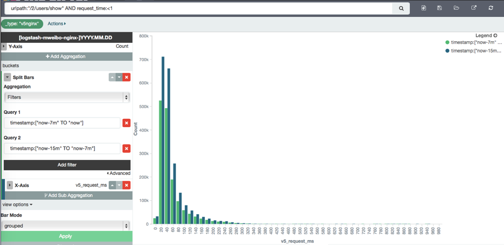

# 响应时间的概率分布在不同时段的相似度对比

前面已经用百分位的时序，展示如何更准确的监控时序数据的波动。那么，还能不能更进一步呢？在制定 SLA 的时候，制定报警阈值的时候，怎么才能确定当前服务的拐点？除了压测以外，我们还可以拿线上服务的实际数据计算一下概率分布。Kibana4 对此提供了直接的支持，我们可以以数值而非时间作为 X 轴数据。

那么进一步，我们怎么区分不同产品在同一时间，或者相同产品在不同时间，性能上有无渐变到质变的可能？这里，我们可以采用 `grouped` 方式，来排列 filter aggs 的结果：



我们可以看出来，虽然两个时间段，响应时间是有一定差距的，但是是整体性的抬升，没有明显的异变。

当然，如果觉得目测不靠谱的，可以把两组数值拿下来，通过 PDL、scipy、matlab、R 等工具做具体的差异显著性检测。这就属于后续的二次开发了。

filter 中，可以写任意的 query string 语法。不限于本例中的时间段：

```
http://k4domain:5601/#/visualize/create?type=histogram&indexPattern=%5Blogstash-mweibo-nginx-%5DYYYY.MM.DD&_g=()&_a=(filters:!(),linked:!f,query:(query_string:(analyze_wildcard:!t,query:'request_time:%3C50')),vis:(aggs:!((id:'1',params:(),schema:metric,type:count),(id:'3',params:(filters:!((input:(query:(query_string:(analyze_wildcard:!t,query:'@timestamp:%5B%22now-7m%22%20TO%20%22now%22%5D')))),(input:(query:(query_string:(analyze_wildcard:!t,query:'@timestamp:%5B%22now-15m%22%20TO%20%22now-7m%22%7D')))))),schema:group,type:filters),(id:'2',params:(extended_bounds:(),field:request_time,interval:1),schema:segment,type:histogram)),listeners:(),params:(addLegend:!t,addTimeMarker:!f,addTooltip:!t,defaultYExtents:!f,mode:grouped,scale:linear,setYExtents:!f,shareYAxis:!t,spyPerPage:10,times:!(),yAxis:()),type:histogram))
```
