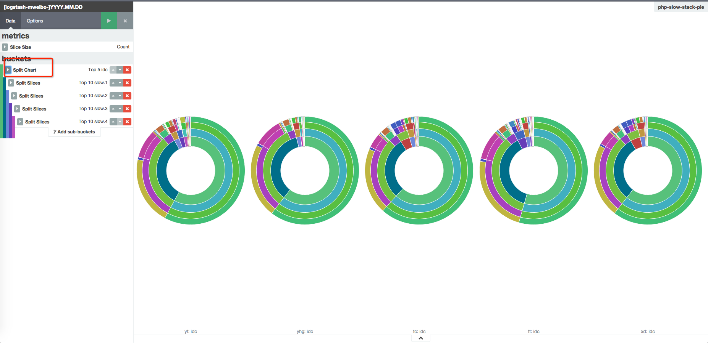

# 分图统计

上一节我们展示了 sub aggs 在饼图上的效果。不过这多层 agg，其实用的是同一类数据。如果在聚合中，要加上一些完全不同纬度的数据，还是在单一的图片上继续累加就不是很直观了。比如说，还是上一节用到的 PHP 慢函数堆栈。我们可以根据机房做一下拆分。由于代码部署等主动变更都是有灰度部署的，一旦发现某机房有异常，就可以及时处理了。

同样还是新建 sub aggs，但是在开始，选择 split chart 而不是 split slice。



从 URL 里可以看到，分图的 aggs 是 `schema:split`，而饼图分片的 aggs 是 `schema:segment`：

```
http://k4domain:5601/#/visualize/edit/php-slow-stack-pie?_g=(refreshInterval:(display:Off,pause:!f,section:0,value:0),time:(from:now-12h,mode:quick,to:now))&_a=(filters:!(),linked:!t,query:(query_string:(query:'*')),vis:(aggs:!((id:'1',params:(),schema:metric,type:count),(id:'6',params:(field:idc,order:desc,orderBy:'1',row:!f,size:5),schema:split,type:terms),(id:'2',params:(field:slow.1,order:desc,orderBy:'1',size:10),schema:segment,type:terms),(id:'3',params:(field:slow.2,order:desc,orderBy:'1',size:10),schema:segment,type:terms),(id:'4',params:(field:slow.3,order:desc,orderBy:'1',size:10),schema:segment,type:terms),(id:'5',params:(field:slow.4,order:desc,orderBy:'1',size:10),schema:segment,type:terms)),listeners:(),params:(addLegend:!f,addTooltip:!t,defaultYExtents:!f,isDonut:!t,shareYAxis:!t,spyPerPage:10),type:pie))
```
