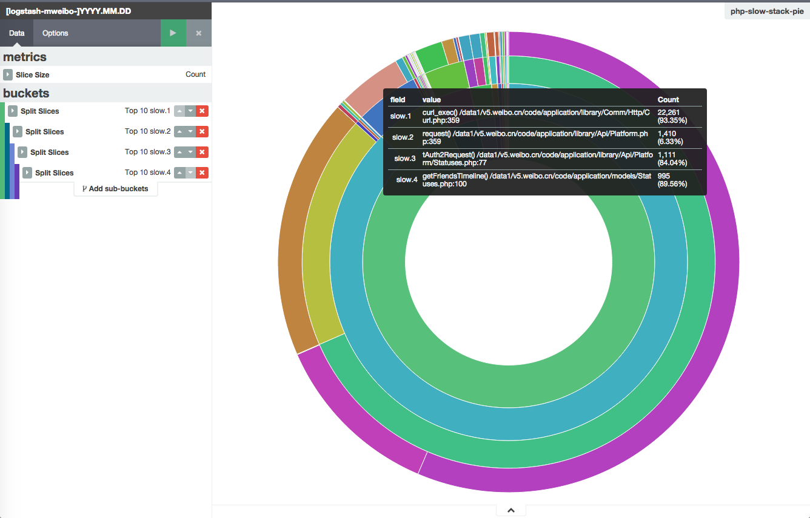

# 函数调用链堆栈

本书之前已经介绍过 logstash 如何利用 multiline 或者 log4j 插件解析函数堆栈。那么，对函数堆栈，我们除了对底层函数做基础的 topN 排序，还能深入发掘出来什么信息呢？

下图是一个 PHP 慢函数堆栈的可视化统计：



该图利用了 Kibana4 的 sub aggs 特性。按照分层次的函数堆栈，逐层做 terms agg。得到一个类似火焰图效果的千层饼效果。

和火焰图不同的是，千层饼并不能自动深入到函数堆栈的全部层次，需要自己手动指定聚合到第几层。考虑到重复操作在页面上不是很方便。可以利用 Kibana4 的 url 特性，直接修改地址生成效果。上图的 url 如下：

```
http://k4domain:5601/#/visualize/edit/php-slow-stack-pie?_g=()&_a=(filters:!(),linked:!t,query:(query_string:(query:'*')),vis:(aggs:!((id:'1',params:(),schema:metric,type:count),(id:'2',params:(field:slow.1,order:desc,orderBy:'1',size:10),schema:segment,type:terms),(id:'3',params:(field:slow.2,order:desc,orderBy:'1',size:10),schema:segment,type:terms),(id:'4',params:(field:slow.3,order:desc,orderBy:'1',size:10),schema:segment,type:terms),(id:'5',params:(field:slow.4,order:desc,orderBy:'1',size:10),schema:segment,type:terms)),listeners:(),params:(addLegend:!f,addTooltip:!t,defaultYExtents:!f,isDonut:!t,shareYAxis:!t,spyPerPage:10),type:pie))
```

可以看到，如果打算增减堆栈的聚合层次，对应增减一段 `(id:'5',params:(field:slow.4,order:desc,orderBy:'1',size:10),` 就可以了。

作为固定可视化分析模式的另一种分享办法，还可以导出该 visualize object 在 `.kibana` 索引中的 JSON 记录。这样其他人只需要原样再导入到自己的 `.kibana` 索引即可：

```
# curl 127.0.0.1:9200/.kibana/visualization/php-slow-stack-pie/_source
{"title":"php-slow-stack-pie","visState":"{\"aggs\":[{\"id\":\"1\",\"params\":{},\"schema\":\"metric\",\"type\":\"count\"},{\"id\":\"2\",\"params\":{\"field\":\"slow.1\",\"order\":\"desc\",\"orderBy\":\"1\",\"size\":10},\"schema\":\"segment\",\"type\":\"terms\"},{\"id\":\"3\",\"params\":{\"field\":\"slow.2\",\"order\":\"desc\",\"orderBy\":\"1\",\"size\":10},\"schema\":\"segment\",\"type\":\"terms\"},{\"id\":\"4\",\"params\":{\"field\":\"slow.3\",\"order\":\"desc\",\"orderBy\":\"1\",\"size\":10},\"schema\":\"segment\",\"type\":\"terms\"},{\"id\":\"5\",\"params\":{\"field\":\"slow.4\",\"order\":\"desc\",\"orderBy\":\"1\",\"size\":10},\"schema\":\"segment\",\"type\":\"terms\"}],\"listeners\":{},\"params\":{\"addLegend\":false,\"addTooltip\":true,\"defaultYExtents\":false,\"isDonut\":true,\"shareYAxis\":true,\"spyPerPage\":10},\"type\":\"pie\"}","description":"","savedSearchId":"php-fpm-slowlog","version":1,"kibanaSavedObjectMeta":{"searchSourceJSON":"{\"filter\":[]}"}}
```

上面记录中可以看到，这个 visualize 还关联了一个 savedSearch，那么同样，再从 `.kibana` 索引里把这个内容也导出：

```
# curl 127.0.0.1:9200/.kibana/search/php-fpm-slowlog/_source
{"title":"php-fpm-slowlog","description":"","hits":0,"columns":["_source"],"sort":["@timestamp","desc"],"version":1,"kibanaSavedObjectMeta":{"searchSourceJSON":"{\n  \"index\": \"[logstash-mweibo-]YYYY.MM.DD\",\n  \"highlight\": {\n    \"pre_tags\": [\n      \"@kibana-highlighted-field@\"\n    ],\n    \"post_tags\": [\n      \"@/kibana-highlighted-field@\"\n    ],\n    \"fields\": {\n      \"*\": {}\n    }\n  },\n  \"filter\": [\n    {\n      \"meta\": {\n        \"index\": \"[logstash-mweibo-]YYYY.MM.DD\",\n        \"negate\": false,\n        \"key\": \"_type\",\n        \"value\": \"php-fpm-slow\",\n        \"disabled\": false\n      },\n      \"query\": {\n        \"match\": {\n          \"_type\": {\n            \"query\": \"php-fpm-slow\",\n            \"type\": \"phrase\"\n          }\n        }\n      }\n    }\n  ],\n  \"query\": {\n    \"query_string\": {\n      \"query\": \"*\",\n      \"analyze_wildcard\": true\n    }\n  }\n}"}}
```

这个内容看起来有点怪怪的，其实把 `searchSourceJSON` 字符串复制出来，在终端下贴到 `echo -ne ` 命令后面，回车即可看到其实是这样：

```
{
  "index": "[logstash-mweibo-]YYYY.MM.DD",
  "highlight": {
    "pre_tags": [
      "@kibana-highlighted-field@"
    ],
    "post_tags": [
      "@/kibana-highlighted-field@"
    ],
    "fields": {
      "*": {}
    }
  },
  "filter": [
    {
      "meta": {
        "index": "[logstash-mweibo-]YYYY.MM.DD",
        "negate": false,
        "key": "_type",
        "value": "php-fpm-slow",
        "disabled": false
      },
      "query": {
        "match": {
          "_type": {
            "query": "php-fpm-slow",
            "type": "phrase"
          }
        }
      }
    }
  ],
  "query": {
    "query_string": {
      "query": "*",
      "analyze_wildcard": true
    }
  }
}
```

