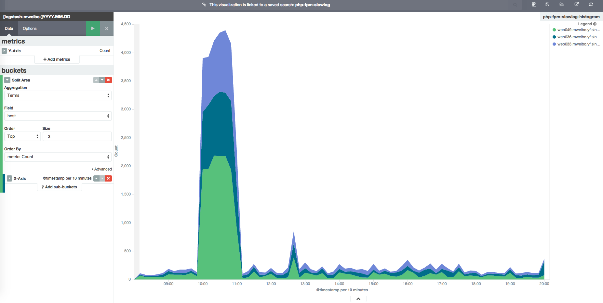

# TopN 的时序趋势图

TopN 的时序趋势图是将 Elastic Stack 用于监控场景最常用的手段。乃至在 Kibana3 时代，开发者都通过在 Query 框上额外定义 TopN 输入的方式提供了这个特性。不过在 Kibana4 中，因为 sub aggs 的依次分桶原理，TopN 时序趋势图又有了新的特点。

Kibana3 中，请求实质是先单独发起一次 termFacet 请求得到 topN，然后再发起带有 facetFilter 的 dateHistogramFacet ，分别请求每个 term 的时序。那么同样的原理，迁移到 Kibana4 中，就是先利用一次 termAgg 分桶后，再每个桶内做 dateHistogramAgg 了。对应的 Kibana4 地址为：

```
http://k4domain:5601/#/visualize/edit/php-fpm-slowlog-histogram?_g=(refreshInterval:(display:Off,pause:!f,section:0,value:0),time:(from:now-12h,mode:quick,to:now))&_a=(filters:!(),linked:!t,query:(query_string:(query:'*')),vis:(aggs:!((id:'1',params:(),schema:metric,type:count),(id:'3',params:(field:host,order:desc,orderBy:'1',size:3),schema:group,type:terms),(id:'2',params:(customInterval:'2h',extended_bounds:(),field:'@timestamp',interval:auto,min_doc_count:1),schema:segment,type:date_histogram)),listeners:(),params:(addLegend:!t,addTimeMarker:!f,addTooltip:!t,defaultYExtents:!t,interpolate:linear,mode:stacked,scale:linear,setYExtents:!f,shareYAxis:!t,smoothLines:!f,times:!(),yAxis:()),type:area))
```

效果如下：



可以看到图上就是 3 根线，分别代表 top3 的 host 的时序。

一般来说，这样都是够用的。不过如果经常有 host 变动的时候，在这么大的一个时间范围内，求一次总的 topN，可能就淹没了一些瞬间的变动了。所以，在 Kibana4 上，我们可以把 sub aggs 的顺序颠倒一下。先按 dateHistogramAgg 分桶，再在每个时间桶内，做 termAgg。对应的 Kibana4 地址为：

```
http://k4domain:5601/#/visualize/edit/php-fpm-slowlog-histogram?_g=(refreshInterval:(display:Off,pause:!f,section:0,value:0),time:(from:now-12h,mode:quick,to:now))&_a=(filters:!(),linked:!t,query:(query_string:(query:'*')),vis:(aggs:!((id:'1',params:(),schema:metric,type:count),(id:'2',params:(customInterval:'2h',extended_bounds:(),field:'@timestamp',interval:auto,min_doc_count:1),schema:segment,type:date_histogram),(id:'3',params:(field:host,order:desc,orderBy:'1',size:3),schema:group,type:terms)),listeners:(),params:(addLegend:!t,addTimeMarker:!f,addTooltip:!t,defaultYExtents:!t,interpolate:linear,mode:stacked,scale:linear,setYExtents:!f,shareYAxis:!t,smoothLines:!f,times:!(),yAxis:()),type:area))
```

可以对比一下前一条 url，其中就是把 id 为 2 和 3 的两段做了对调。而最终效果如下：


差距多么明显！
