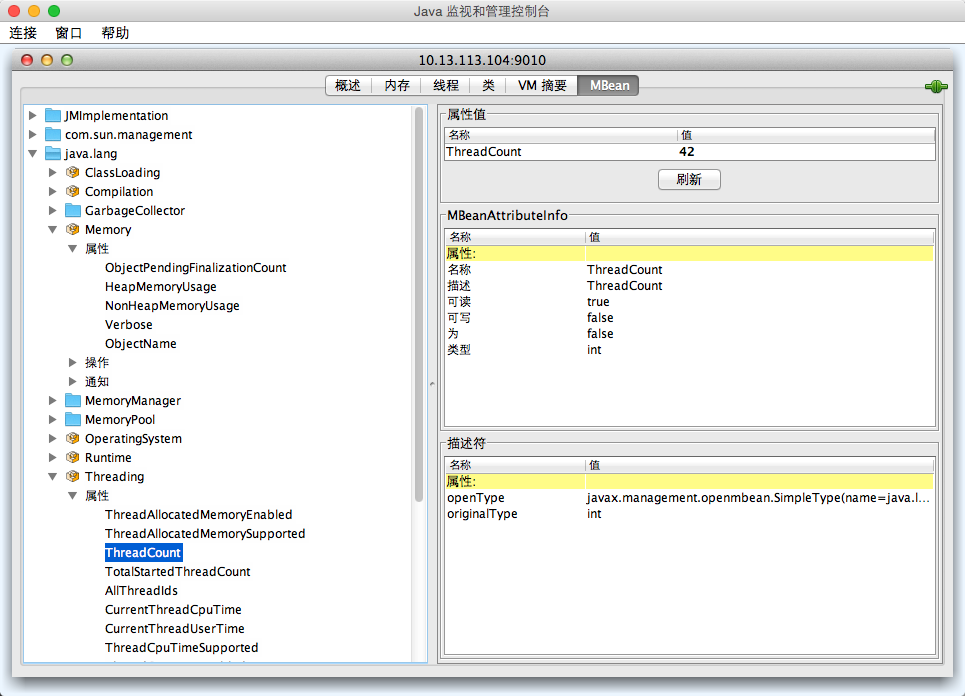

# JMX 监控方式

Logstash 是一个运行在 JVM 上的软件，也就意味着 JMX 这种对 JVM 的通用监控方式对 Logstash 也是一样有效果的。要给 Logstash 启用 JMX，需要修改 `./bin/logstash.lib.sh` 中 `$JAVA_OPTS` 变量的定义，或者在运行时设置 `LS_JAVA_OPTS` 环境变量。

在 `./bin/logstash.lib.sh` 第 34 行 `JAVA_OPTS="$JAVA_OPTS -Djava.awt.headless=true"` 下，添加如下几行：

```
    JAVA_OPTS="$JAVA_OPTS -Dcom.sun.management.jmxremote"
    JAVA_OPTS="$JAVA_OPTS -Dcom.sun.management.jmxremote.port=9010"
    JAVA_OPTS="$JAVA_OPTS -Dcom.sun.management.jmxremote.local.only=false"
    JAVA_OPTS="$JAVA_OPTS -Dcom.sun.management.jmxremote.authenticate=false"
    JAVA_OPTS="$JAVA_OPTS -Dcom.sun.management.jmxremote.ssl=false"
```

重启 logstash 服务，JMX 配置即可生效。

有 JMX 以后，我们可以通过 jconsole 界面查看，也可以通过 zabbix 等监控系统做长期监控。甚至 logstash 自己也有插件 logstash-input-jmx 来读取远程 JMX 数据。

## zabbix 监控

zabbix 里提供了专门针对 JMX 的监控项。详见:<https://www.zabbix.com/documentation/2.2/manual/config/items/itemtypes/jmx_monitoring>

注意，zabbix-server 本身并不直接对 JMX 发起请求，而是单独有一个 Java Gateway 作为中间代理层角色。zabbix-server 的 java poller 连接 zabbix-java-gateway，由 zabbix-java-gateway 去获取远程 JMX 信息。所以，在 zabbix-web 配置之前，需要先配置 zabbix server 相关进程和设置：

```
# yum install zabbix-java-gateway
# cat >> /etc/zabbix/zabbix-server.conf <<EOF
JavaGateway=127.0.0.1
JavaGatewayPort=10052
StartJavaPollers=5
EOF
# /etc/init.d/zabbix-java-gateway restart
# /etc/init.d/zabbix-server restart
```

然后在 zabbix-web 上 **Configuration** 页，给运行 logstash 的主机的 **Host** 配置添加 **JMX interfaces**，**Port** 即为上面定义的 9010 端口。

最后添加 Item，**Type** 下拉框选择 `JMX agent`，**Key** 文本框输入 `jmx["java.lang:type=Memory", "HeapMemoryUsage.used"]`，保存即可。

JMX 有很多 Key 可以监控，具体的值，可以通过 jconsole 参看。如下图所示，如果要监控线程数，就可以写成 `jmx["java.lang:type=Threading", "ThreadCount"]`。



有了监控项和数据，后续的 Graph, Screen, Trigger 定义，这里就不再讲述了，有需要的读者可以自行查找 Zabbix 相关资料。
