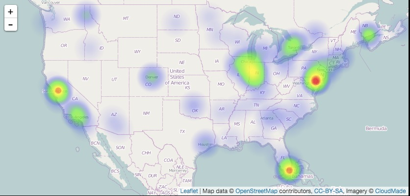
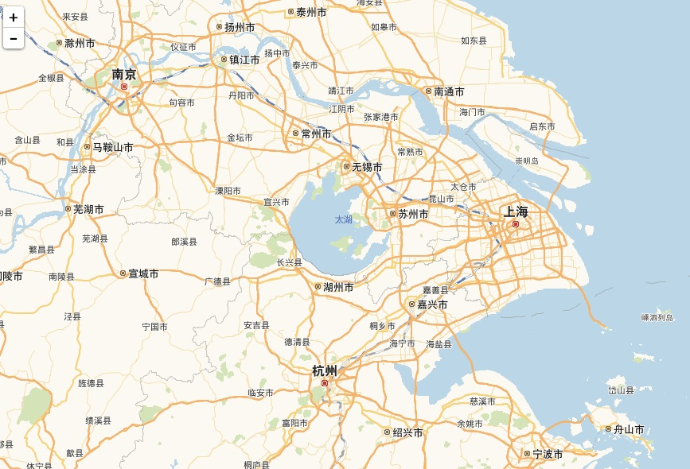

# bettermap

状态：实验性

Bettermap 之所以叫 bettermap 是因为还没有更好(better)的名字。Bettermap 使用地理坐标来在地图上创建标记集群，然后根据集群的密度，用橘色，黄色和绿色作为区分。

要查看细节，点击标记集群。地图会放大，原有集群分裂成更小的集群。一直小到没法成为集群的时候，单个标记就会显现出来。悬停在标记上可以查看 `tooltip` 设置的值。

**注意:** bettermap 需要从互联网上下载它的地图面板文件。

## 参数

* field

    包含了地理坐标的字段，要求是 geojson 格式。GeoJSON 是一个数组，内容为 `[longitude,latitude]` 。这可能跟大多数实现([latitude, longitude])是反过来的。

* size

    用来绘制地图的数据集大小

* spyable

    设为假，不显示审查(inspect)按钮。

* tooltip

    悬停在标记上时显示哪个字段。

**请求(queries)**

* 请求对象

    这个对象描述本面板使用的请求。

  * queries.mode

    在可用请求中应该用哪些？可设选项有：`all, pinned, unpinned, selected`

  * queries.ids

    如果设为 `selected` 模式，具体被选的请求编号。

-----------------------------

## 界面配置说明

bettermap 面板是为了解决 map 面板地图种类太少且不方便大批量添加各国地图文件的问题开发的。它采用了 [leaflet 库](http://leafletjs.com/)，其 `L.tileLayer` 加载的 OpenStreetMap 地图文件都是在使用的时候单独请求下载，所以在初次使用的时候会需要一点时间才能正确显示。

leaflet 库有丰富的[插件资源](http://leafletjs.com/plugins.html)。比如

* [热力图](http://www.patrick-wied.at/static/heatmapjs/example-heatmap-leaflet.html)

* [高德地图](https://github.com/htoooth/Leaflet.ChineseTmsProviders)

*小贴士：其实 Kibana 官方效果的标记集群也是插件实现的，叫[markercluster](https://github.com/Leaflet/Leaflet.markercluster)*
