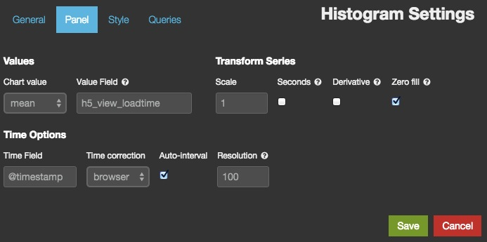
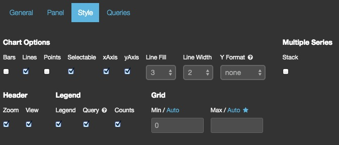
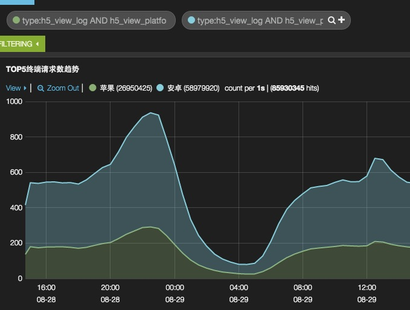

# histogram

状态：稳定

histogram 面板用以显示时间序列图。它包括好几种模式和变种，用以显示时间的计数，平均数，最大值，最小值，以及数值字段的和，计数器字段的导数。

## 参数

**轴(axis)参数**

* mode

    用于 Y 轴的值。除了 count 以外，其他 `mode` 设置都要求定义 `value_field` 参数。可选值为：count, mean, max, min, total。

* time_field

    X 轴字段。必须是在 Elasticsearch 中定义为时间类型的字段。

* value_field

    如果 `mode` 设置为 mean, max, min 活着 total，Y 轴字段。必须是数值型。

* x-axis

    是否显示 X 轴。

* y-axis

    是否显示 Y 轴。

* scale

    以该因子规划 Y 轴

* y_format

   Y 轴数值格式，可选：none, bytes, short

**注释**

* 注释对象

    可以指定一个请求的结果作为标记显示在图上。比如说，标记某时刻部署代码了。

  * annotate.enable

    是否显示注释(即标记)

  * annotate.query

    标记使用的 Lucene query_string 语法请求

  * annotate.size

    最多显示多少标记

  * annotate.field

    显示哪个字段

  * annotate.sort

    数组排序，格式为 [field,order]。比如 [‘@timestamp’,‘desc’] ，这是一个内部参数。

* auto_int

    是否自动调整间隔

* resolution

    如果 `auto_int` 设为真，shoot for this many bars.

* interval

    如果 `auto_int` 设为假，用这个值做间隔

* intervals

    在 `View` 选择器里可见的间隔数组。比如 [‘auto’,‘1s’,‘5m’,‘3h’]，这是绘图参数。

* lines

    显示折线图

* fill

    折线图的区域填充因子，从 1 到 10。

* linewidth

    折线的宽度，单位为像素

* points

    在图上显示数据点

* pointradius

    数据点的大小，单位为像素

* bars

    显示条带图

* stack

    堆叠多个序列

* spyable

    显示审核图标

* zoomlinks

    显示 ‘Zoom Out’ 链接

* options

    显示快捷的 view 选项区域

* legend

    显示图例

* show_query

    如果没设别名(alias)，是否显示请求

* interactive

    允许点击拖拽进行放大

* legend_counts

    在图例上显示计数

* timezone

    是否调整成浏览器时区。可选值为：browser, utc

* percentage

    把 Y 轴数据显示成百分比样式。仅对多个请求时有效。

* zerofill

    提高折线图准确度，稍微消耗一点性能。

* derivative

    在 X 轴上显示该点数据在前一个点数据上变动的数值。

* 提示框(tooltip)对象

  * tooltip.value_type

    控制 tooltip 在堆叠图上怎么显示，可选值：独立(individual)还是累计(cumulative)

  * tooltip.query_as_alias

    如果没设别名(alias)，是否显示请求

* 网格(grid)对象

    Y 轴的最大值和最小值

  * grid.min

    Y 轴的最小值

  * grid.max

    Y 轴的最大值

**请求(queries)**

* 请求对象

    这个对象描述本面板使用的请求。

  * queries.mode

    在可用请求中应该用哪些？可设选项有：`all, pinned, unpinned, selected`

  * queries.ids

    如果设为 `selected` 模式，具体被选的请求编号。

-----------------------------

## 界面配置说明

添加面板的方式在之前的"[行和面板](../rows-and-panels.md)"一节中已经有过讲解。在 "Add panel"对话框选择类型为 "histogram" 后，你会看到一系列可配置的选项：

选项分为四类，可以在添加之后，通过点击面板右上角的配置"Configure"小图标弹出浮层继续修改。

* 通用(General)配置

  主要用来修改面板的标题和宽度

  

* 面板(Panel)配置

  设置面板向 Elasticsearch 发出何种请求，以及请求中需要使用的变量。

  

  在 histogram 面板中，经常用的 `Chart value`(即**参数**部分描述的`mode`) 有：

  * count

    最常见场景就是统计请求数。这种时候只需要提供一个**在 Elasticsearch 中是时间类型**的字段(即**参数**部分描述的 `time_field`)即可。一般来说，都是 `@timestamp`，所以不用修改了。这也是默认的 Logstash 仪表板的基础面板的样式

    

  * mean

    最常见场景就是统计平均时间。这时候配置浮层会变成下面这个样子：

    

    这里就需要提供一个**在 Elasticsearch 中是数值类型**的字段(即**参数**部分描述的 `value_field`)作为计算平均值的数据集来源了。以 nginx 访问日志为例，这里就填 "request_time"。

    

  * total

    最常见场景就是统计带宽。配置界面和 mean 是一样的。同样要求填写**数值类型**的字段名，比如 "bytes_sent"。

    

    带宽在习惯上会换算成每秒数据，但是通过修改 `interval` 的方式来求每秒数据，对 elasticsearch 性能是一个很大的负担，绘制出来的图形也太过密集影响美观。所以 Kibana 提供了另一种方式：保持 `interval`，勾选 `seconds`。Kibana 会自动将每个数值除以间隔秒数得到每秒数据。

    

    另一个有用的功能，假如你的日志量实在太大，被迫采用抽样日志的方式，可以在 Kibana 上填写 `Scale` 。比如百分之一的抽样日志，`Scale` 框就写 100，带宽数据就会在展示的时候自动翻 100 倍显示出来。

    

* 风格(Style)配置

  

  设置获取的数据如何展现。其中小部分(即条带(Bars)、折线(Lines)、散点(Points))可以直接在面板左上角的 "View" 下拉菜单里直接勾选。

  

  对于带宽数据，可以切换 `Y Format` 为 **bytes**。则 Y 轴数据可以自动换算成 MB，GB 的形式，比较方便

  

  此外，还可以在 Grid 区域定义 Y 轴的起始点和终点的具体值。这可以用来在 Y 轴上放大部分区域，观察细微变动；或者忽略某些异常值。

  

  如果面板关联了多个请求，可以勾选以堆叠(`Stack`)方式展示(最常见的堆叠展示的监控数据就是 CPU 监控)。

  

  堆叠的另一种形式是百分比。在勾选了 `Stack` 的前提下勾选 `Percent`。

  

* 关联请求(Queries)配置

