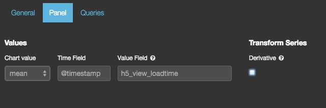
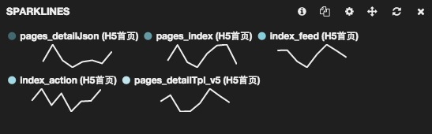
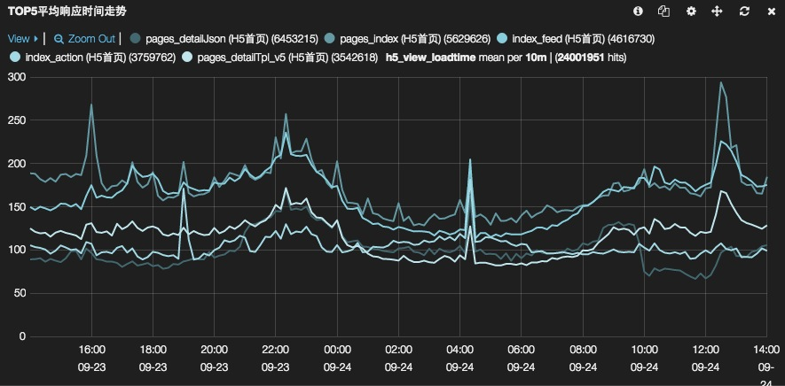

# sparklines

状态: 试验性

sparklines 面板显示微型时间图。目的不是显示一个确切的数值，而是以紧凑的方式显示时间序列的形态。

## 参数

* mode
    用作 Y 轴的数值模式。除 count 以外，都需要定义 `value_field` 字段。可选值有：count, mean, max, min, total.
* time_field
    X 轴字段。必须是 Elasticsearch 中的时间类型字段。
* value_field
    如果 mode 设置为 mean, max, min 或者 total，Y 轴字段。必须是数值类型字段。
* interval
    如果有现成的时间过滤器，Sparkline 会自动计算间隔。如果没有，就用这个间隔。默认是 5 分钟。
* spyable
    显示 inspect 图标。

**请求(queries)**

* 请求对象
    这个对象描述本面板使用的请求。
  * queries.mode
    在可用请求中应该用哪些？可设选项有：`all, pinned, unpinned, selected`
  * queries.ids
    如果设为 `selected` 模式，具体被选的请求编号。

-----------------------------

## 界面配置说明

sparklines 面板其实就是 histogram 面板的缩略图模式。在配置上，只能选择 Chart value 模式，填写 Time Field 或者 Value Field 字段。上文描述中的 interval 在配置页面上是看不到的。

我们可以对比一下对同一个 topN 请求绘制的 sparklines 和 histogram 面板的效果：

* sparklines

* histogram

*注：topN 请求的配置和说明，见 [query 面板](query.md)*
