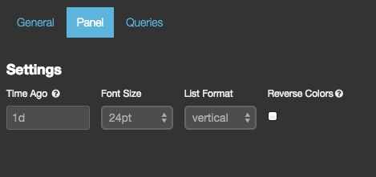

# trends

状态: Beta

以证券报价器风格展示请求随着时间移动的情况。比如说：当前时间是 1:10pm，你的时间选择器设置的是 "Last 10m"，而本面板的 "Time Ago" 参数设置的是 "1h"，那么面板会显示的是请求结果从 12:00-12:10pm 以来变化了多少。

## 参数

* ago

    描述需要对比请求的时期的时间数值型字符串。

* arrangement

    ‘horizontal’ 或 ‘vertical’

* spyable

    设为假，不显示审查(inspect)按钮。

**请求(queries)**

* 请求对象

    这个对象描述本面板使用的请求。

  * queries.mode

    在可用请求中应该用哪些？可设选项有：`all, pinned, unpinned, selected`

  * queries.ids

    如果设为 `selected` 模式，具体被选的请求编号。

-----------------------------

## 界面配置说明

trends 面板用来对比实时数据与过去某天的同期数据的量的变化。配置很简单，就是设置具体某天前：

效果如下：

