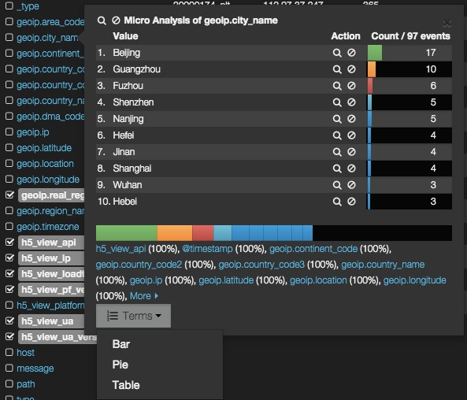

# table

状态：稳定

表格面板里是一个可排序的分页文档。你可以定义需要排列哪些字段，并且还提供了一些交互功能，比如执行 terms 聚合查询。

## 参数

* size

    每页显示多少条

* pages

    展示多少页

* offset

    当前页的页码

* sort

    定义表格排序次序的数组，示例如右：[‘@timestamp’,‘desc’]

* overflow

    css 的 overflow 属性。‘min-height’ (expand) 或 ‘auto’ (scroll)

* fields

    表格显示的字段数组

* highlight

    高亮显示的字段数组

* sortable

    设为假关掉排序功能

* header

    设为假隐藏表格列名

* paging

    设为假隐藏表格翻页键

* field_list

    设为假隐藏字段列表。使用者依然可以展开它，不过默认会隐藏起来

* all_fields

    设为真显示映射表内的所有字段，而不是表格当前使用到的字段

* trimFactor

    裁剪因子(trim factor)，是参考表格中的列数来决定裁剪字段长度。比如说，设置裁剪因子为 100，表格中有 5 列，那么每列数据就会被裁剪为 20 个字符。完整的数据依然可以在展开这个事件后查看到。

* localTime

    设为真调整 `timeField` 的数据遵循浏览器的本地时区。

* timeField

    如果 `localTime` 设为真，该字段将会被调整为浏览器本地时区。

* spyable

    设为假，不显示审查(inspect)按钮。

**请求(queries)**

* 请求对象

    这个对象描述本面板使用的请求。

  * queries.mode

    在可用请求中应该用哪些？可设选项有：`all, pinned, unpinned, selected`

  * queries.ids

    如果设为 `selected` 模式，具体被选的请求编号。

-----------------------------

## 界面配置说明

table 和 histogram 面板，是 kibana 默认的 logstash 仪表板里唯二使用的面板。可以说是最重要和常用的组件。

虽然重要，table 面板的可配置项却不多。主要是 panel 和 paging 两部分：

### panel

panel 设置可以分成几类，其中比较重要和有用的是：

* 时间字段

*Time Field* 设置的作用，和 `histogram` 面板中类似，主要是帮助 Kibana 使用者自动转换 elasticsearch 中的 UTC 时间成本地时间。

* 裁剪因子

和 Splunk 不同，Kibana 在显示事件字段的时候，侧重于单行显示。详情内容通过**点击具体某行向下展开**的方式参看。每个字段在屏幕中的可用宽度，就会通过裁剪因子来计算。计算方式见官方参数说明部分。

* 字段列表

table 面板左侧，是字段列表多选区域。字段分为 *_all* 和 *current* 两种。*_all* 是 Kibana 通过 elasticsearch 的 `_mapping` API 直接获取的索引内所有存在过的字段；*current* 则仅显示 **table 匹配范围内**的数据用到的字段。

勾选字段列表中某个字段，该字段就加入 table 面板右侧的表格中成为一列。

字段列表中，可以点击具体字段，查看 **table 匹配范围内**该字段数据的统计和排行数据的小面板。

小面板上虽然只显示一个很小范围内(即size * pages，默认是 500)的数据统计，但是点击小面板底部的 **TERMS** 下拉菜单选项，生成的 term panel 浮层数据却都是基于整个搜索结果的。这部分的内容介绍。请阅读 [term panel](./terms.md) 章节。

* 排序

设置中可以设置一个默认的排序字段。在 logstash 仪表板默认的 event table 中，设置的是时间字段 `@timestamp` 。**不过这个设置，指的是面板加载的时候，使用该字段排序**，实际你可以在表头任意字段名上单击，以该字段的值来临时排序。排序字段会在表头本列字段名后，出现一个小三角图标，三角箭头朝上代表升序，反之降序：

* 高亮

elasticsearch 作为一种搜索引擎，很贴心的提供了高亮功能。Kibana 中也同样支持解析 ES 返回的 HTML 高亮文本。只需要在 panel 标签页右侧添加 `Highlighted field`，在搜索框里填入的关键词，如果出现在被指定为 *Highlighted field* 的字段里，这个词在 table 里就会高亮显示(前提是该字段已经在字段列表中勾选)。

*小贴士：高亮仅在 table 状态有效，点击展开后的事件详情中是不会高亮的。*

### paging

考虑到同时展示太多内容，一来对 elasticsearch 压力较大，二来影响页面展示效果和渲染性能。

